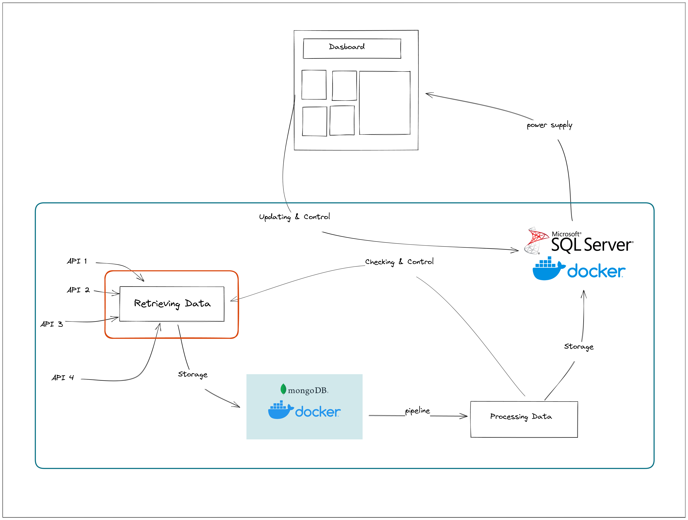

## Projet UNIX 2023
# Consommation d'énergies en France

Ce projet a pour but de récupérer des données sur les différents types d'énergies en France à travers l'API open data. Les données récupérées sont ensuite stockées dans deux serveurs différents : MongoDB Server et SQL Server. Par la suite, des tableaux de bord illustrant la consommation énergétique des différentes énergies en France sont produits à l'aide de Dash (python) et une interface web est créée pour visualiser ces tableaux de bord.
## Installation

Installer les dépendances nécessaires au projet:
init.sh installe toutes les dépendances nécessaires pour le projet

```bash
  chmod +x init.sh
  sudo ./init.sh
```

## Deployment

Pour déployer le projet:
Une fois l'infrastructure des données (serveurs MongoDB/SQL Server) créés et initialisés:
```bash
  sudo ./run_app.sh
```
une fois run_app exécuté, l'interface web est créée un url pour visualiser les tableaux de bord


## Screenshots


## Tech Stack
Coté serveur:
docker,MongoDB Server (container), SQL Server (container)

Dashboards:
Dash (avec python)

Librairies python:
pandas,plotly,pandas,pymongo,SQLAlchemy,validators,pyodbc,regex

## Schema
Un schéma est disponible pour mieux visualiser l'architecture :

### Générale process


### Less specific process


### More specific process


## Virtual Machine
Une machine virtuelle configurée avec VirtualBox est mise à disposition pour le projet:

-Il vous suffira de lancer les deux serveurs MongoDB/SQL Server en utilisant la commande :

```bash
sudo docker start mongodb sqlserver
```

-exécuter le script run_app.sh:

```bash
  sudo ./run_app.sh
```

Il est important de ne PAS lancer le script init.sh, car l'initialisation a déjà été effectuée dans la machine virtuelle.

Lien de la machine: https://filesender.renater.fr/?s=download&token=d2082a4b-9a80-402a-b3b1-9290af7cdbe3


